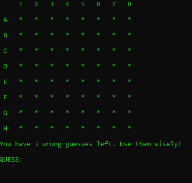
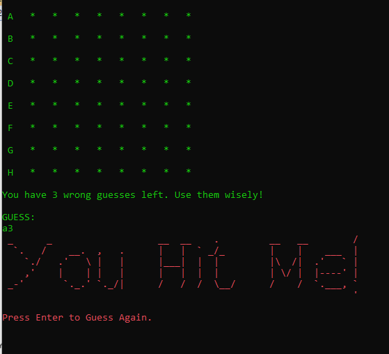
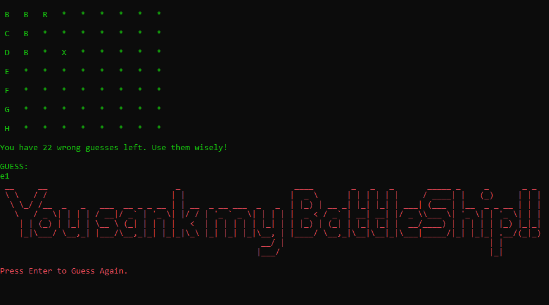
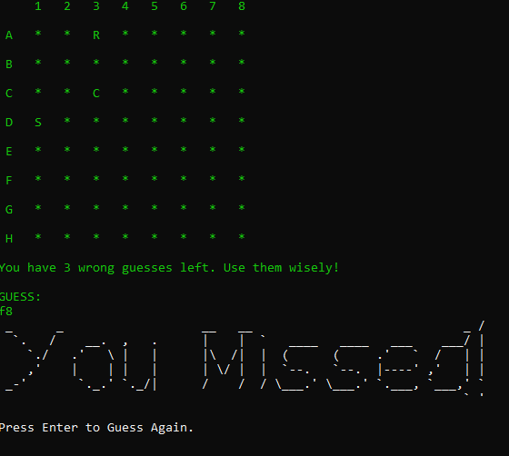
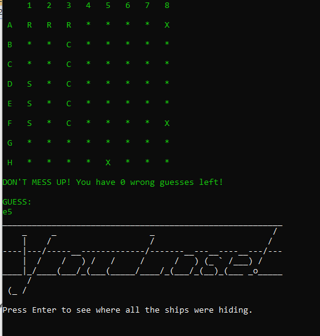
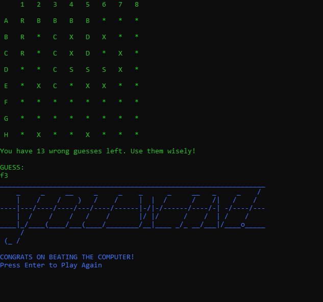

# BattleShip

This build is a version of the classic BattleShip game I cherished while growing up. It is a one player game where the code randomly places the ships and you choose a difficulty level to see if you can beat the game staying within a certain amount of wrong answers.

I learned the basics of .NET/C# in the first 4 weeks of Tech Elelvator and I created this basic console game to practice skills using OOP. I solidified most of the concepts of the language as well as learning brand new things - it was both challenging and fulfilling. The most difficult part of this build was learning how to manipulate 2-D arrays, especially to randomly place the ships. My favorite part was trying to refactor the code where the same logic was used twice. There are still a few things I would like to tinker with as well as eventually adding in the option of having the user pick the size of the grid. I also thought to use this same logic with MVC to make the game visually appealing. For now, the game is playable and FUN! Enjoy!

Here are some screen captures from the game:
* Starting grid
* You Hit Me!
* You Sank My Battleship!
* You Missed!
* You Lose!
* You Win!

Thanks!